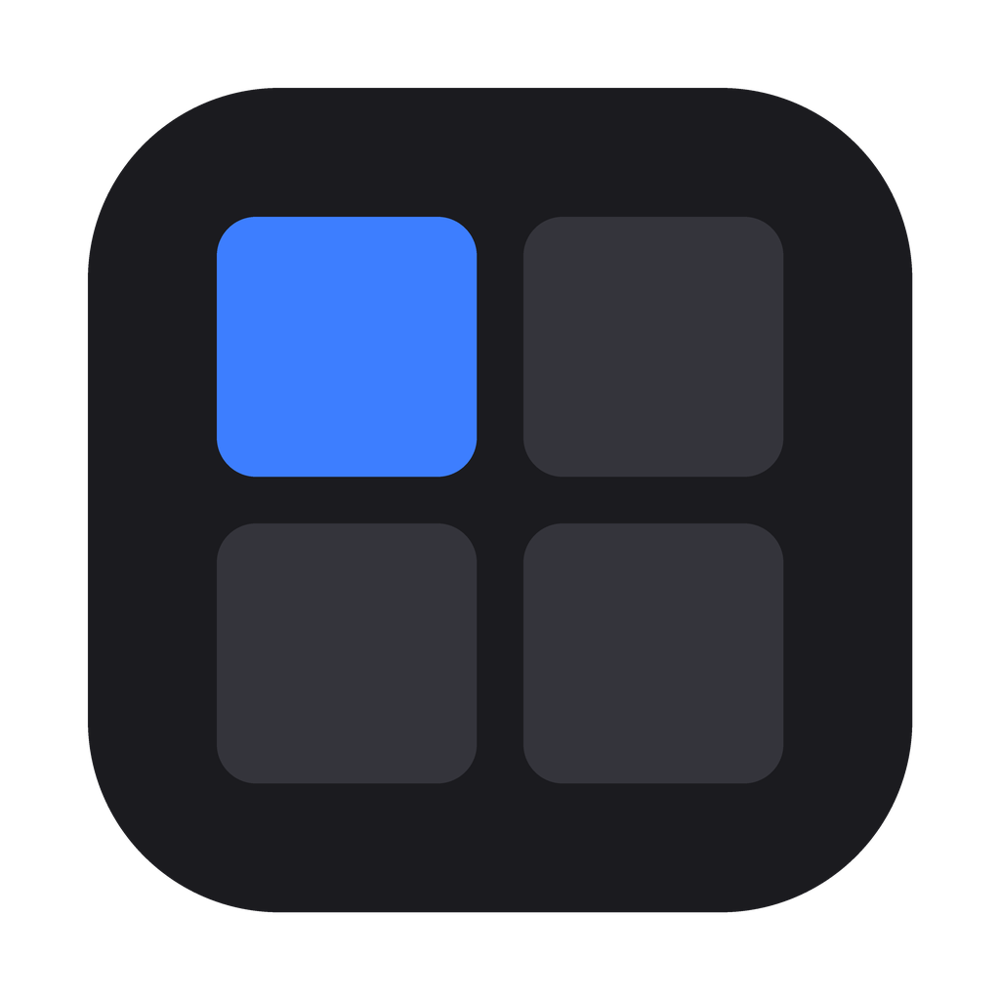
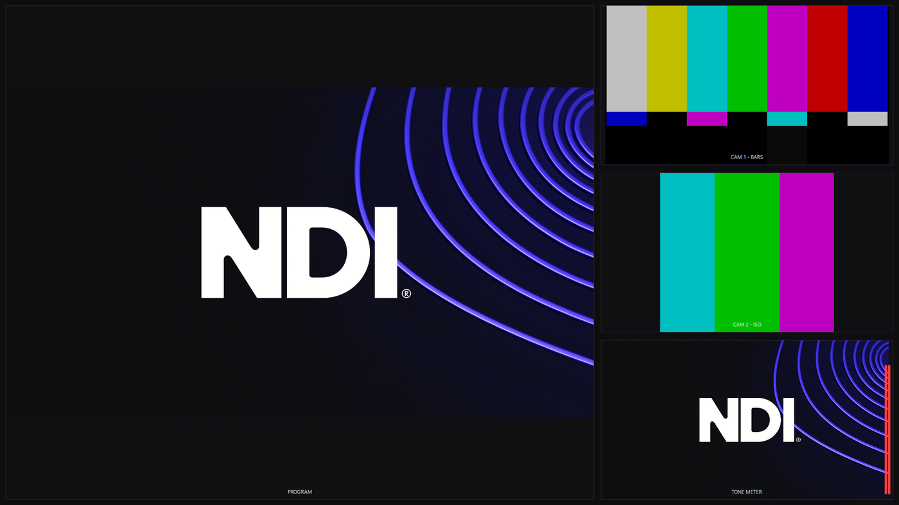

<div align="center">



# Mosaic

**A professional NDI® multiviewer for Windows and macOS.**

Discover every NDI® source on your network and arrange them as free-form video
tiles — with GPU zoom / pan / crop on every tile, instantly switchable
profiles, multi-monitor output, and Stream Deck remote control.

[**⬇ Download for Windows**](https://github.com/TehBeef/cinertia-mosaic/releases/latest) · [**⬇ Download for macOS**](https://github.com/TehBeef/cinertia-mosaic/releases/latest) · [User Guide](docs/USER-GUIDE.md) · [Changelog](docs/CHANGELOG.md)



</div>

---

## Features

- **Automatic NDI® discovery** — every source on the network appears in the
  sidebar; click to add. Duplicate the same source into several tiles.
- **Free-form canvas** — drag, resize, and layer tiles anywhere, or snap them
  to a grid. One-click broadcast layouts: 2×2, 3×3, 4×4, 1+side, 2+8.
- **GPU view controls on every tile** — scroll to zoom, drag to pan, crop to
  a detail, rotate; instant and always at source frame rate (Direct3D on
  Windows, Metal on macOS).
- **Profiles** — save a complete "look" (sources + layout + per-tile views)
  and switch instantly, from the sidebar, hotkeys, or a Stream Deck.
- **Multi-monitor canvases** — extra output windows, each its own canvas:
  windowed, fullscreen on a chosen display, or frameless.
- **Display modes** — windowed, borderless fullscreen, and a chrome-free
  windowless mode with hover-reveal controls.
- **Stream Deck / Bitfocus Companion** — native Companion module with live
  profile dropdowns, active-profile feedback, and variables (plus a
  plain-TCP fallback protocol).
- **Show-day details** — per-tile rename, source-name overlays, audio
  meters, low-bandwidth mode for small tiles, keep-display-awake, session
  autosave and restore.

## Install

| | |
|---|---|
| **Windows 10/11** | Run `Mosaic-Setup-<version>.exe` from the [latest release](https://github.com/TehBeef/cinertia-mosaic/releases/latest). Allow network access when Windows Firewall asks. |
| **macOS 12+** (Apple Silicon & Intel) | Open `Mosaic-<version>.dmg` from the [latest release](https://github.com/TehBeef/cinertia-mosaic/releases/latest), drag **Mosaic** to **Applications**. First launch: **right-click → Open**, then **Allow** the Local Network permission (that's NDI discovery). |

Full details in the [User Guide](docs/USER-GUIDE.md).

## Remote control

Mosaic speaks to [Bitfocus Companion](https://bitfocus.io/companion) for
Stream Deck control — switch profiles, apply layouts, and change display
modes from physical buttons, with the active profile lit up. See
[`companion-module/`](companion-module/) for the native module and the
[User Guide](docs/USER-GUIDE.md#remote-control-stream-deck--bitfocus-companion)
for the simple TCP protocol.

## Building from source

Qt 6.8 / C++17 / CMake, plus the [NDI SDK](https://ndi.video/for-developers/ndi-sdk/).

```bash
cmake -S . -B build -DCMAKE_PREFIX_PATH=<Qt prefix> -DCMAKE_BUILD_TYPE=Release
cmake --build build
```

Packaging: `scripts/stage-deploy.ps1` (Windows installer),
`scripts/stage-deploy-mac.sh` (macOS .dmg).

---

<div align="center">
<sub>

Mosaic is a working title by **Cinertia Systems**.
NDI® is a registered trademark of Vizrt NDI AB — [ndi.video](https://ndi.video).

</sub>
</div>
